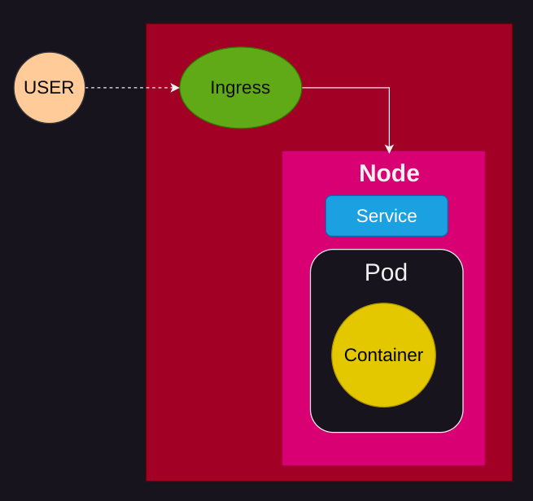
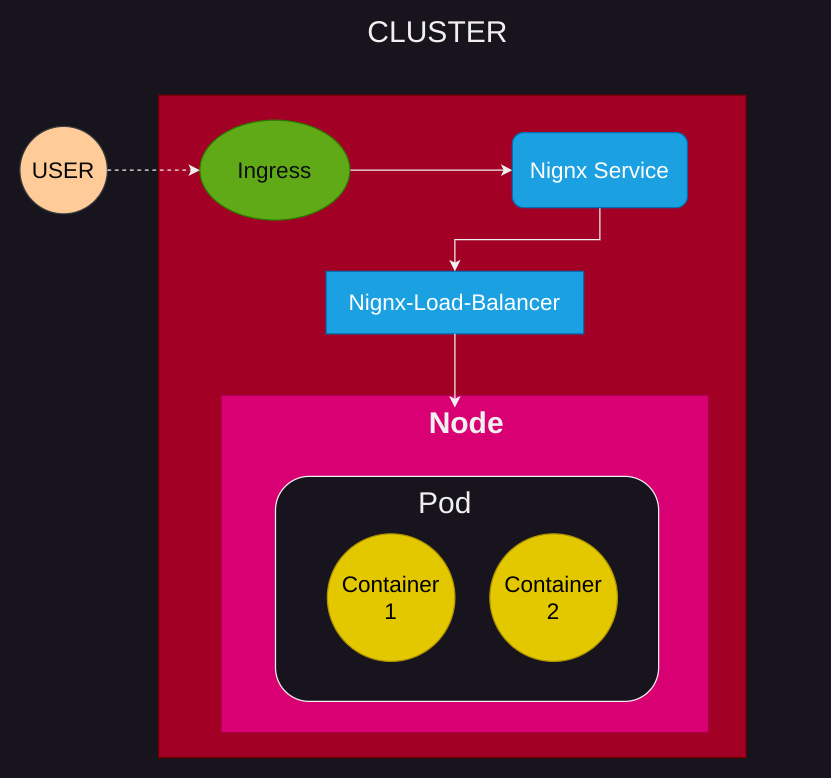
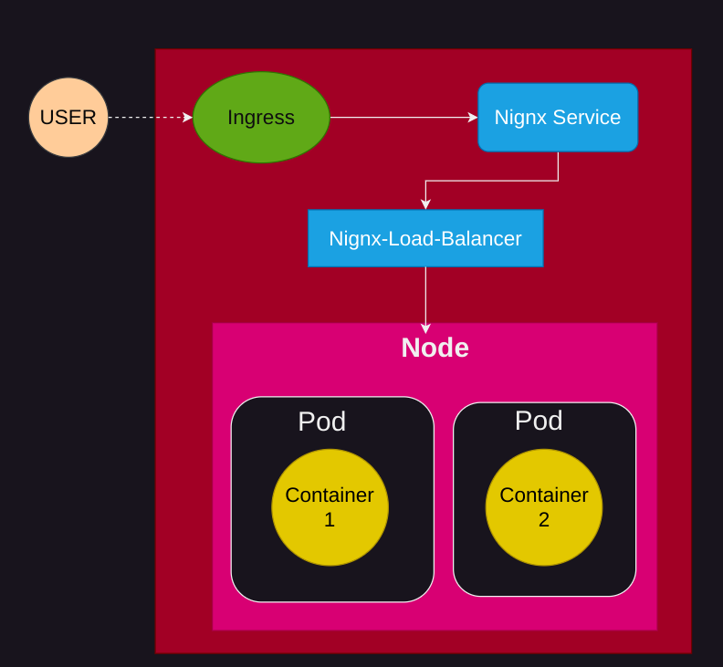
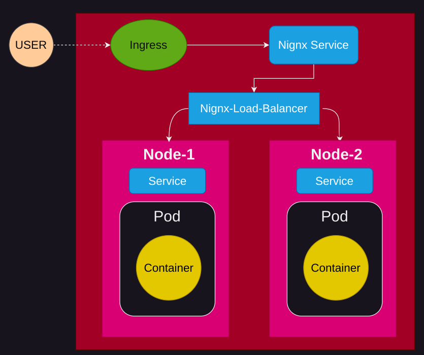
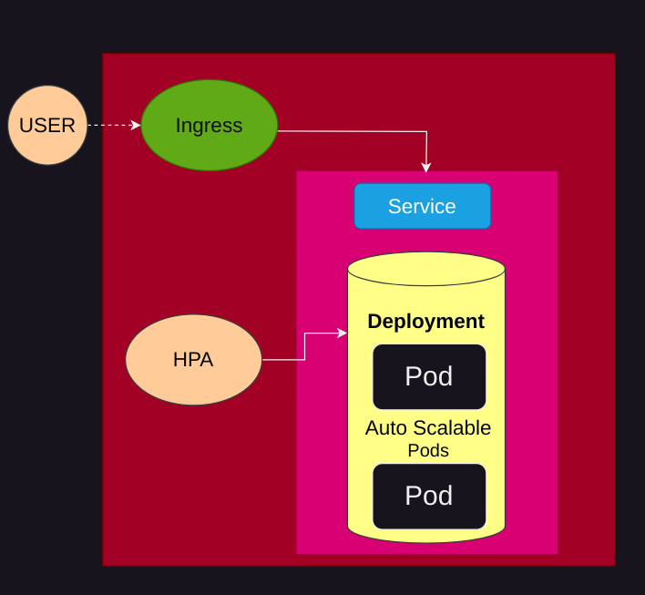
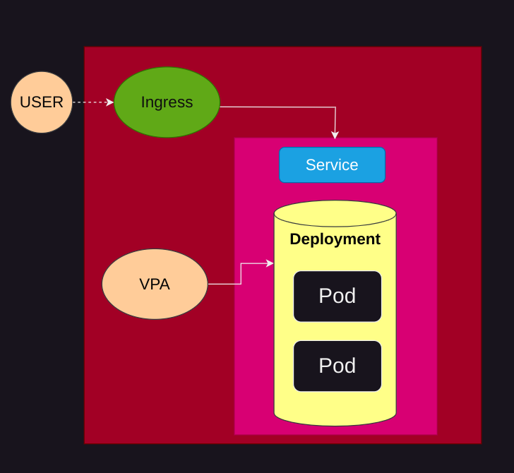

# Faast-A-Faas-Framework
```
Faast = FaaS + K8s
```
This project aims at testing various cluster configuration for Faas (**Function as a Service**) platform and performing analysis using various metrics like latency, throughput, resource utilization etc. We only consider worloads which are stateless in our experiments. 

We utilize *kubernetes* tool in order to create cluster environment and deploy FaaS Services and perform analysis. 

### Cluster Configurations
1) **Single Pod Cluster** 
    - This contains a single pod with a single container deployed in a single node cluster. 
    - The following image shows the cluster configuration:
        

2) **Single Pod with Multi-Container** 
    - This contains a pod with multiple containers deployed in a single node cluster with each container running the same service. 
    - This also contains a pod which runs a *nginx-loadbalancer* and routes the incoming requests to the both the containers of the pod running FaaS service.
    - The following image shows the cluster configuration:
    

3) **Multi-Pod with Single Node** 
    - This contains multiple pods (each containing one container which runs FaaS service) deployed in a single node. 
    - This also contains a pod which runs a *nginx-loadbalancer* and routes the incoming requests to the pods running FaaS service. 
    - The following image shows the cluster configuration:
    

4) **Multi-Pod with Multi-Node** 
    - This contains multiple pods (each containing one container which runs FaaS service) deployed in two different nodes.
    - This also contains a pod which runs a *nginx-loadbalancer* and routes the incoming requests to the pods running FaaS service via their respective services.
    - The following image shows the cluster configuration:
    

5) **Horizontal Pod Autoscaler** 
    - This contains multiple replica set of pods (initially containing single pod) deployed in a single node.
    - HPA *scales out* when the resource requirements goes beyond the set limits and adjust the number of pods accordingly. 
    - The following image shows the cluster configuration:
    

6) **Vertical Pod Autoscaler**
    - This contains a single pod enabled with VPA deployed in a single node. 
    - VPA *scales up* when the resource requirements goes beyond the set limits and adjust the pod resources accordingly. 
    - The following image shows the cluster configuration:
    

### Metrics
1) **Latency and Throughput** 
    - We measure the latency and throughput of the FaaS service using *wrk* tool. 
    - We perform the analysis for different cluster configurations and compare the results. 
    - The following image shows the latency and throughput comparison for different cluster configurations:
    

2) **Resource Utilization (CPU + Mem)**
    - We measure the *CPU* and *Memory* utilization of the FaaS service using *metrics-server* api of kubernetes.
    - We perform the analysis for different cluster configurations and compare the results.
    - The following images shows the resource utilization comparison for different cluster configurations:
   
### Worload for Testing
- We use two kinds of simple stateless worloads in order to test for various cluster environments.
    - **Beauituful Loops** - This worload simply runs a for loop doing some simple computation.
    - **Random Weird Text** - This worload simply generates some random text and returns it as response. 

### Requirements
- We need to install the following tools in order to run the experiments:
    - [docker](https://docs.docker.com/get-docker/)
    - [kubectl](https://kubernetes.io/docs/tasks/tools/install-kubectl/)
    - [minikube](https://kubernetes.io/docs/tasks/tools/install-minikube/)
    - [helm](https://helm.sh/docs/intro/install/)


### Running Instructions for Setting up a Cluster Environment    
- Run the following command to setup the environment for running cluster configurations
    ```bash
    bash setup.sh
    ```
- Supported app-types based on the cluster configuration defined above are 
    ```bash
        single-pod  two-pod-same-node  two-pod-diff-node  hpa  vpa  two-container
    ```
- Run the following command with the appropriate *<app_type>* to setup the requirements for running clusters: 
    ```bash
    bash deploy_app.sh <app_name> <app_type> <docker_image_name> <python-app-file> <requirements-file> <port> <map_url>
    ```

### Generating Analysis Results
- We need to setup metrics-server REST-API. Run the following command in two different terminal windows:
    ```bash
    minikube dashboard --port=20000
    ```

- Now, run the following command to perform the analysis for different cluster configurations to generate the logs for response-time and resource utilization:
    ```bash
    bash src/analysis/perform_analysis.sh <host> <url> <app-type> <app-name>
    ```
    This will generate the all the logs for response-time and resource utilization based on a worload defined earlier.
    The file names are in the following format:
    ```bash
    <logs-dir>/<app-name-<app-type>-response_time.csv
    <logs-dir>/<app-name-<app-type>-resource_usage.csv
    ```
- Execute the following python file to generate the plots for the analysis:
    ```bash
    usage: script to generate plot from log files
       [-h] --app-type APP_TYPE
       [--response-log RESPONSE_LOG]
       [--resources-log RESOURCES_LOG] --output-folder OUTPUT_FOLDER
    ```

