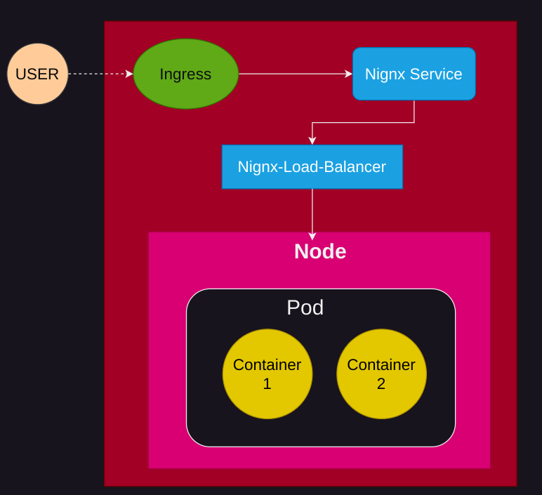

# Faast-A-Faas-Framework
```
Faast = FaaS + K8s
```
This project aims at testing various cluster configuration for Faas (**Function as a Service**) platform and performing analysis using various metrics like latency, throughput, resource utilization etc. We only consider worloads which are stateless in our experiments. 

We utilize *kubernetes* tool in order to create cluster environment and deploy FaaS Services and perform analysis. 

### Requirements 
- *minikube* - This tool is used to create a simple cluster and does the initial setup [Install Minikube](https://kubernetes.io/docs/tasks/tools/install-minikube/)
             - We also require addons in minikube such as metrics-server, dashboard, ingress inn order to create cluster environment and perform our experiments
- *kubectl* - This tool is used to interact with the cluster and deploy functions [Install Kubectl](https://kubernetes.io/docs/tasks/tools/install-kubectl/) 


### Cluster Configuration
1) **Single Pod Cluster** 
    - This contains a single pod with a single container deployed in a single node cluster. 
    - The following image shows the cluster configuration:
    

2) **Single Pod with Multi-Container** 
    - This contains a pod with multiple containers deployed in a single node cluster with each container running the same service. 
    - This also contains a pod which runs a *nginx-loadbalancer* and routes the incoming requests to the both the containers of the pod running FaaS service.
    - The following image shows the cluster configuration:
    

3) **Multi-Pod with Single Node** 
    - This contains multiple pods (each containing one container which runs FaaS service) deployed in a single node. 
    - This also contains a pod which runs a *nginx-loadbalancer* and routes the incoming requests to the pods running FaaS service. 
    - The following image shows the cluster configuration:
    

4) **Multi-Pod with Multi-Node** 
    - This contains multiple pods (each containing one container which runs FaaS service) deployed in two different nodes.
    - This also contains a pod which runs a *nginx-loadbalancer* and routes the incoming requests to the pods running FaaS service via their respective services.
    - The following image shows the cluster configuration:
    

5) **Horizontal Pod Autoscaler** 
    - This contains multiple replica set of pods (initially containing single pod) deployed in a single node.
    - HPA *scales out* when the resource requirements goes beyond the set limits and adjust the number of pods accordingly. 
    - The following image shows the cluster configuration:
    

6) **Vertical Pod Autoscaler**
    - This contains a single pod enabled with VPA deployed in a single node. 
    - VPA *scales up* when the resource requirements goes beyond the set limits and adjust the pod resources accordingly. 
    - The following image shows the cluster configuration:
    

### Metrics
1) **Latency and Throughput** 
    - We measure the latency and throughput of the FaaS service using *wrk* tool. 
    - We perform the analysis for different cluster configurations and compare the results. 
    - The following image shows the latency and throughput comparison for different cluster configurations:
    

2) **Resource Utilization (CPU + Mem)**
    - We measure the *CPU* and *Memory* utilization of the FaaS service using *metrics-server* api of kubernetes.
    - We perform the analysis for different cluster configurations and compare the results.
    - The following images shows the resource utilization comparison for different cluster configurations:
   

### Running Instructions for Simulating the Cluster Configuration
#### Setup
- Clone the repository and navigate to the directory
- Install the required tools which are [kubectl](https://kubernetes.io/docs/tasks/tools/install-kubectl/), [minikube](https://kubernetes.io/docs/tasks/tools/install-minikube/) and [helm](https://helm.sh/docs/intro/install/)
- Run the following command to simulate the cluster configuration:
    ```
    bash src/setup.sh
    ```
#### Generating Analysis Results
- We need to setup two more things which are tunneling and metrics-server REST-API. Run the following command in two different terminal windows:
    ```
    minikube tunnel
    ```
    ```
    minikube dashboard --port=20000
    ```

- Now, run the following command to perform the analysis for different cluster configurations:
    ```
    bash src/analysis/perform_analysis.sh <host> <url> <app-type> <app-name>
    ```


